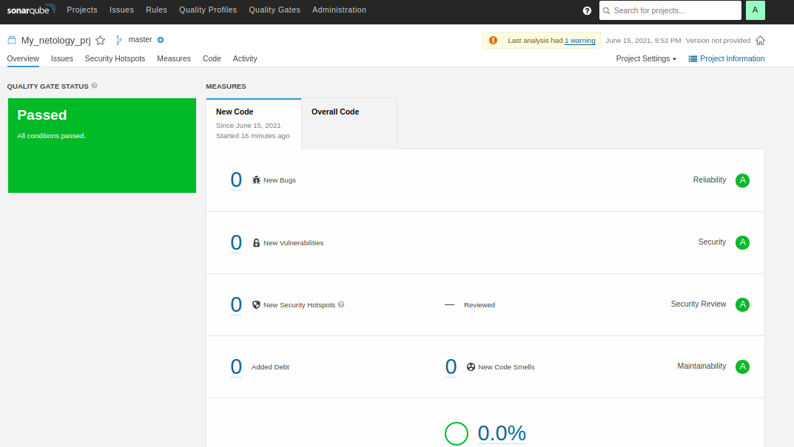
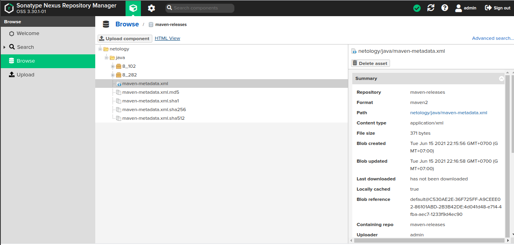

# Домашнее задание к занятию "09.03 CI\CD""
## Подготовка к выполнению

1. Создаём 2 VM в yandex cloud со следующими параметрами: 2CPU 4RAM Centos7(остальное по минимальным требованиям)
2. Прописываем в inventory playbook'a созданные хосты
3. Добавляем в files файл со своим публичным ключом (id_rsa.pub). Если ключ называется иначе - найдите таску в плейбуке, которая использует id_rsa.pub имя и исправьте на своё
4. Запускаем playbook, ожидаем успешного завершения
5. Проверяем готовность Sonarqube через браузер
6. Заходим под admin\admin, меняем пароль на свой
7. Проверяем готовность Nexus через бразуер
8. Подключаемся под admin\admin123, меняем пароль, сохраняем анонимный доступ

## Знакомоство с SonarQube

### Основная часть

1. Создаём новый проект, название произвольное
2. Скачиваем пакет sonar-scanner, который нам предлагает скачать сам sonarqube
3. Делаем так, чтобы binary был доступен через вызов в shell (или меняем переменную PATH или любой другой удобный вам способ)
4. Проверяем sonar-scanner --version
5. Запускаем анализатор против кода из директории example с дополнительным ключом -Dsonar.coverage.exclusions=fail.py
6. Смотрим результат в интерфейсе
7. Исправляем ошибки, которые он выявил(включая warnings)
8. Запускаем анализатор повторно - проверяем, что QG пройдены успешно
9. Делаем скриншот успешного прохождения анализа, прикладываем к решению ДЗ

## Ответ:



## Знакомство с Nexus

### Основная часть

1. В репозиторий maven-public загружаем артефакт с GAV параметрами:
* groupId: netology
* artifactId: java
* version: 8_282
* classifier: distrib
* type: tar.gz
2. В него же загружаем такой же артефакт, но с version: 8_102
3. Проверяем, что все файлы загрузились успешно
4. В ответе присылаем файл maven-metadata.xml для этого артефекта

## Ответ:



[Ссылка на maven-metadata.xml](https://github.com/kezan860/devops/blob/main/mnt-homeworks/08_ci3/maven-metadata.xml)

## Знакомство с Maven

### Подготовка к выполнению

1. Скачиваем дистрибутив с maven
2. Разархивируем, делаем так, чтобы binary был доступен через вызов в shell (или меняем переменную PATH или любой другой удобный вам способ)
3. Удаляем из apache-maven-<version>/conf/settings.xml упоминание о правиле, отвергающем http соединение( раздел mirrors->id: my-repository-http-unblocker)
4. Проверяем mvn --version
5. Забираем директорию mvn с pom

### Основная часть

1. Меняем в pom.xml блок с зависимостями под наш артефакт из первого пункта задания для Nexus (java с версией 8_282)
2. Запускаем команду mvn package в директории с pom.xml, ожидаем успешного окончания
3. Проверяем директорию ~/.m2/repository/, находим наш артефакт
4. В ответе присылаем исправленный файл pom.xml

## Ответ:

[Ссылка на pom.xml](https://github.com/kezan860/devops/blob/main/mnt-homeworks/08_ci3/pom.xml)

```
 ls -l
итого 16
-rw-rw-r-- 1 vlad vlad 257 апр 30 22:37 java-8_282-distrib.tar.gz
-rw-rw-r-- 1 vlad vlad  40 апр 30 22:37 java-8_282-distrib.tar.gz.sha1
-rw-rw-r-- 1 vlad vlad 388 апр 30 22:37 java-8_282.pom.lastUpdated
-rw-rw-r-- 1 vlad vlad 181 апр 30 22:37 _remote.repositories
```